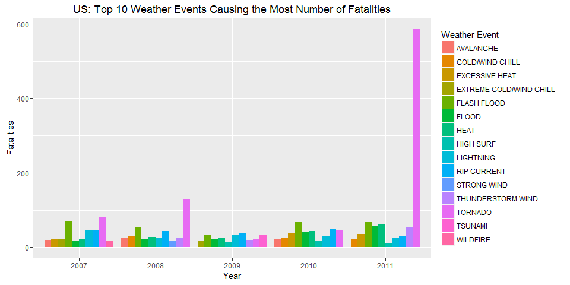
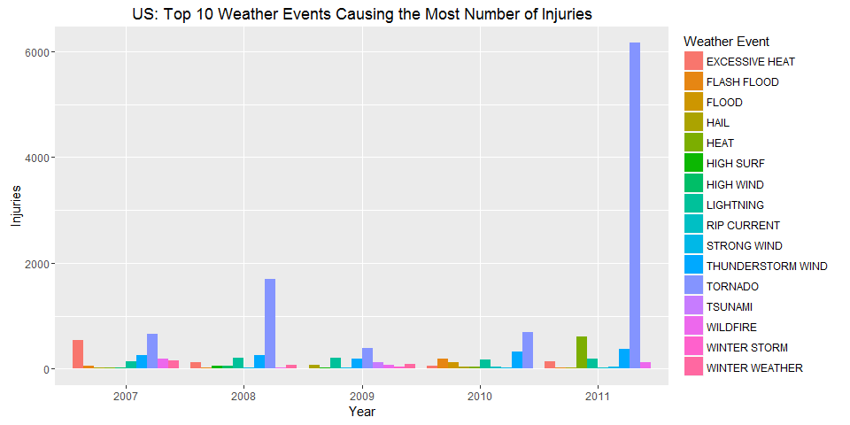
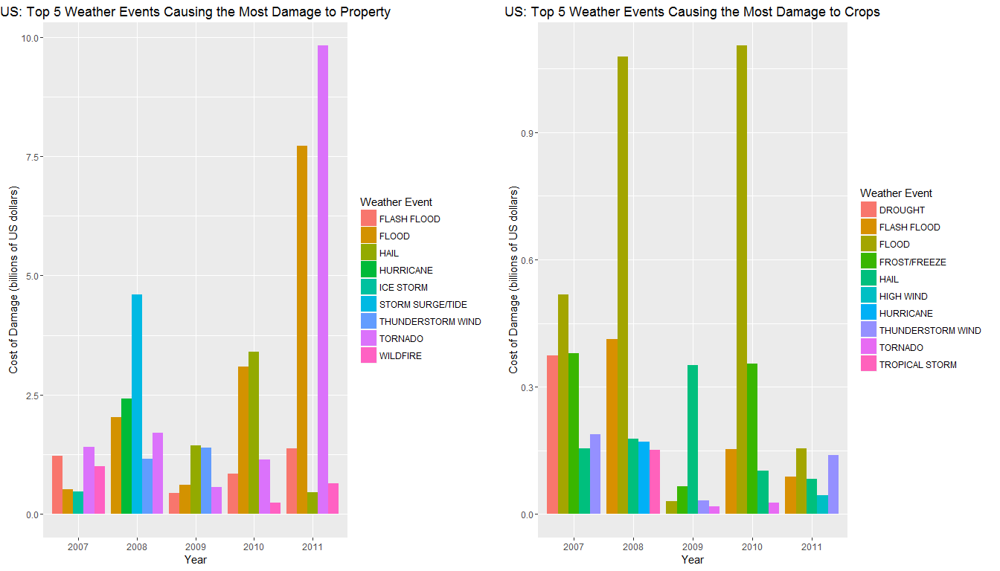

# **Consequences of Weather Events on Population Health and Economics: An Analysis of NOAA Storm Data**


**Jayson Trinchera**  
**August 26, 2016**  
**Last updated 2016-08-26 02:19:42 using R version 3.3.1 (2016-06-21)**  

# **Synopsis**  
Storms and other severe weather events can cause both public health and economic problems for communities and municipalities. Many severe events can result in fatalities, injuries, and property damage, and preventing such outcomes to the extent possible is a key concern.

This project involves exploring the U.S. National Oceanic and Atmospheric Administration's (NOAA) storm database. This database tracks characteristics of major storms and weather events in the United States, including when and where they occur, as well as estimates of any fatalities, injuries, and property damage. The events in the database start in the year 1950 and end in November 2011. In the earlier years of the database there are generally fewer events recorded, most likely due to a lack of good records.  

This project will seek to address the following questions:  
- Across the United States, which types of events are most harmful with respect to population health?  
- Across the United States, which types of events have the greatest economic consequences?  

Because of fewer events recorded in the early years of the database, this project only looked at recorded events within the last five years (2007-2011). Within this range, tornadoes have been consistently included in the top 10 weather events causing the most number of fatalities and injuries. Of particular note, it caused the greatest number of casualties in 2011 compared to the previous years. Aside from tornadoes, however, there have been other events that have caused harm to humans of varying magnitude. These include flash floods, extremes of heat and cold, lightnight, and rip currents.

In terms of economic damage, again, tornadoes have caused the greatest damage to property in 2011, whereas flooding has been consistently at the top in the past five years for both damages to property and crops. There are other causes in the list, albeit variable in magnitude yearly. Among crops, damages from drought and frost have also been significant.  

# **Data Processing**  

## **Loading the Data**  


```r
# downloads the data
if(!file.exists("./StormData.csv")) {
  fileUrl <- "https://d396qusza40orc.cloudfront.net/repdata%2Fdata%2FStormData.csv.bz2"
  download.file(fileUrl, destfile="./StormData.csv.bz2")
  unzip(zipfile="./StormData.csv.bz2")
}

# loads the data
data <- read.csv("StormData.csv")
```

## **Data Cleaning and Tidying**  

In summary, the cleaning and tidying process involved:  
- subsetting the original data set for the relevant variables  
- transforming the date variable into date class, and subsetting the year  
- replacing the characters in PROPDMGEXP and CROPDMGEXP with appropriate factor 
- computing the respective damages by multiplying the base value in PROPDMG and CROPDMG with the appropriate factor  
- melting and aggregating the numeric variables (FATALITIES, INJURIES, PROPDMGVAL, CROPDMGVAL) by year and event type  


```r
# subset original data for the following variables
data2 <- data[, c("BGN_DATE", "EVTYPE", "FATALITIES", "INJURIES", "PROPDMG", "PROPDMGEXP", "CROPDMG", "CROPDMGEXP")]

# fix dates, get year
data2$BGN_DATE <- gsub(" 0:00:00", "", data2$BGN_DATE)
data2$YEAR <- as.POSIXlt(as.Date(data2$BGN_DATE, "%m/%d/%Y"))$year + 1900

# fix exponents
exp <- c(1e+03, 1e+06, 1, 1e+09, 1e+06, 1, 1, 1e+05, 1e+06, 0, 1e+04, 1e+02, 1e+03, 1e+02, 1e+07, 1e+02, 0, 1, 1e+08, 1e+03)
names(exp) <- union(unique(data2$PROPDMGEXP), unique(data2$CROPDMGEXP))
exp <- exp[order(exp)]
data2$PROPDMGEXP <- exp[match(data2$PROPDMGEXP, names(exp))]
data2$CROPDMGEXP <- exp[match(data2$CROPDMGEXP, names(exp))]

# compute damage value
data2$PROPDMGVAL <- data2$PROPDMG*data2$PROPDMGEXP
data2$CROPDMGVAL <- data2$CROPDMG*data2$CROPDMGEXP

# subset tidy data
data3 <- data2[, c(2:4,9:11)]
str(data3)
```

```
## 'data.frame':	902297 obs. of  6 variables:
##  $ EVTYPE    : Factor w/ 985 levels "   HIGH SURF ADVISORY",..: 834 834 834 834 834 834 834 834 834 834 ...
##  $ FATALITIES: num  0 0 0 0 0 0 0 0 1 0 ...
##  $ INJURIES  : num  15 0 2 2 2 6 1 0 14 0 ...
##  $ YEAR      : num  1950 1950 1951 1951 1951 ...
##  $ PROPDMGVAL: num  25000 2500 25000 2500 2500 2500 2500 2500 25000 25000 ...
##  $ CROPDMGVAL: num  0 0 0 0 0 0 0 0 0 0 ...
```

```r
# melt data
if (!require(reshape2)) install.packages("reshape2")
mdata <- melt(data3, id = c("YEAR", "EVTYPE"))
str(mdata)
```

```
## 'data.frame':	3609188 obs. of  4 variables:
##  $ YEAR    : num  1950 1950 1951 1951 1951 ...
##  $ EVTYPE  : Factor w/ 985 levels "   HIGH SURF ADVISORY",..: 834 834 834 834 834 834 834 834 834 834 ...
##  $ variable: Factor w/ 4 levels "FATALITIES","INJURIES",..: 1 1 1 1 1 1 1 1 1 1 ...
##  $ value   : num  0 0 0 0 0 0 0 0 1 0 ...
```

```r
# aggregates the variables (i.e. fatalities, injuries, propdmg, cropdmg) by year and event type
d1 <- dcast(mdata, YEAR+EVTYPE ~ variable, sum)
head(d1)
```

```
##   YEAR  EVTYPE FATALITIES INJURIES PROPDMGVAL CROPDMGVAL
## 1 1950 TORNADO         70      659   34481650          0
## 2 1951 TORNADO         34      524   65505990          0
## 3 1952 TORNADO        230     1915   94102240          0
## 4 1953 TORNADO        519     5131  596104700          0
## 5 1954 TORNADO         36      715   85805320          0
## 6 1955    HAIL          0        0          0          0
```

```r
tail(d1)
```

```
##      YEAR         EVTYPE FATALITIES INJURIES PROPDMGVAL CROPDMGVAL
## 2321 2011 TROPICAL STORM          4        1  138742200   24501000
## 2322 2011        TSUNAMI          1        0   53554000          0
## 2323 2011     WATERSPOUT          0        0    5110000          0
## 2324 2011       WILDFIRE          6      116  648318400    9797000
## 2325 2011   WINTER STORM          1        0   18157000      70000
## 2326 2011 WINTER WEATHER          2        0    1895000          0
```

# **Results**  

## **Weather Events Most Harmful to Humans**  

### **Fatalities**  


```r
# grabs fatalities, filters observations from 2007, groups by year, ranks according to most number of fatalities, and selects only top 10 events per year
if (!require(dplyr)) install.packages("dplyr")
d2 <- d1 %>% select(YEAR, EVTYPE, FATALITIES) %>% arrange(YEAR, desc(FATALITIES)) %>% filter(YEAR > 2006 & FATALITIES != 0) %>% group_by(YEAR) %>% mutate(RANK = rank(FATALITIES, "min")) %>% mutate(RANK = max(RANK)-RANK+1) %>% filter(RANK <= 10)

# plots fatalities by year and event type
if (!require(ggplot2)) install.packages("ggplot2")
g1 <- ggplot(d2, aes(x=factor(YEAR), y=FATALITIES, fill=EVTYPE)) + geom_bar(stat="identity", position="dodge") + labs(x="Year", y="Fatalities",fill="Weather Event", title="US: Top 10 Weather Events Causing the Most Number of Fatalities")
g1
```

<!-- -->

Tornadoes have consistently been included in the top 10 weather events that have costed human lives. In particular, it claimed the most mortality in 2011 compared to previous years. Deaths from flash floods and flooding have also been high in the past five years.  

### **Injuries**  


```r
# grabs injuries, filters observations from 2007, groups by year, ranks according to most number of injuries, and selects only top 10 events per year
d3 <- d1 %>% select(YEAR, EVTYPE, INJURIES) %>% arrange(YEAR, desc(INJURIES)) %>% filter(YEAR > 2006 & INJURIES != 0) %>% group_by(YEAR) %>% mutate(RANK = rank(INJURIES, "min")) %>% mutate(RANK = max(RANK)-RANK+1) %>% filter(RANK <= 10)

# plots injuries by year and event type
g2 <- ggplot(d3, aes(x=factor(YEAR), y=INJURIES, fill=EVTYPE)) + geom_bar(stat="identity", position="dodge") + labs(x="Year", y="Injuries",fill="Weather Event", title="US: Top 10 Weather Events Causing the Most Number of Injuries")
g2
```

<!-- -->

Similarly, tornadoes account for the most number of injuries in the past five years. Other causes, however, have been variable.  

## **Weather Events with Most Economic Damage**  


```r
# grabs damage to property, filters observations from 2007, groups by year, ranks according to value, and selects only top 5 events per year
d4 <- d1 %>% select(YEAR, EVTYPE, PROPDMGVAL) %>% arrange(YEAR, desc(PROPDMGVAL)) %>% filter(YEAR > 2006 & PROPDMGVAL != 0) %>% group_by(YEAR) %>% mutate(RANK = rank(PROPDMGVAL, "min")) %>% mutate(RANK = max(RANK)-RANK+1) %>% filter(RANK <= 5)

# plots propdmgval by year and event type
g3 <- ggplot(d4, aes(x=factor(YEAR), y=PROPDMGVAL/(1e+09), fill=EVTYPE)) + geom_bar(stat="identity", position="dodge") + labs(x="Year", y="Cost of Damage (billions of US dollars)",fill="Weather Event", title="US: Top 5 Weather Events Causing the Most Damage to Property")

# grabs damage to crops, filters observations from 2007, groups by year, ranks according to value, and selects only top 5 events per year
d5 <- d1 %>% select(YEAR, EVTYPE, CROPDMGVAL) %>% arrange(YEAR, desc(CROPDMGVAL)) %>% filter(YEAR > 2006 & CROPDMGVAL != 0) %>% group_by(YEAR) %>% mutate(RANK = rank(CROPDMGVAL, "min")) %>% mutate(RANK = max(RANK)-RANK+1) %>% filter(RANK <= 5)

# plots cropdmgval by year and event type
g4 <- ggplot(d5, aes(x=factor(YEAR), y=CROPDMGVAL/(1e+09), fill=EVTYPE)) + geom_bar(stat="identity", position="dodge") + labs(x="Year", y="Cost of Damage (billions of US dollars)",fill="Weather Event", title="US: Top 5 Weather Events Causing the Most Damage to Crops")

# plots damages to property and crop side-by-side
if (!require(gridExtra)) install.packages("gridExtra")
grid.arrange(g3, g4, ncol=2)
```

<!-- -->

Tornadoes have caused a great damage to property in the past five years, particularly in 2011. Damages to both property and crops due to flooding have also been consistently high. Among crops, damage from frost and drought also contribute a big chunk, next to flooding.
